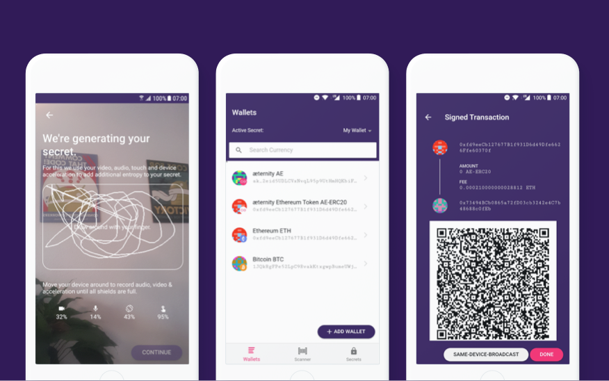

# AirGap Vault

<<<<<<< HEAD


## Getting started

To make it easy for you to get started with GitLab, here's a list of recommended next steps.

Already a pro? Just edit this README.md and make it your own. Want to make it easy? [Use the template at the bottom](#editing-this-readme)!

## Add your files

- [ ] [Create](https://gitlab.com/-/experiment/new_project_readme_content:b4d1b4ae9e798fc77fc6f282686b8b66?https://docs.gitlab.com/ee/user/project/repository/web_editor.html#create-a-file) or [upload](https://gitlab.com/-/experiment/new_project_readme_content:b4d1b4ae9e798fc77fc6f282686b8b66?https://docs.gitlab.com/ee/user/project/repository/web_editor.html#upload-a-file) files
- [ ] [Add files using the command line](https://gitlab.com/-/experiment/new_project_readme_content:b4d1b4ae9e798fc77fc6f282686b8b66?https://docs.gitlab.com/ee/gitlab-basics/add-file.html#add-a-file-using-the-command-line) or push an existing Git repository with the following command:

```
cd existing_repo
git remote add origin https://gitlab.com/p2804/airgap-vault.git
git branch -M main
git push -uf origin main
```

## Integrate with your tools

- [ ] [Set up project integrations](https://gitlab.com/-/experiment/new_project_readme_content:b4d1b4ae9e798fc77fc6f282686b8b66?https://docs.gitlab.com/ee/user/project/integrations/)

## Collaborate with your team

- [ ] [Invite team members and collaborators](https://gitlab.com/-/experiment/new_project_readme_content:b4d1b4ae9e798fc77fc6f282686b8b66?https://docs.gitlab.com/ee/user/project/members/)
- [ ] [Create a new merge request](https://gitlab.com/-/experiment/new_project_readme_content:b4d1b4ae9e798fc77fc6f282686b8b66?https://docs.gitlab.com/ee/user/project/merge_requests/creating_merge_requests.html)
- [ ] [Automatically close issues from merge requests](https://gitlab.com/-/experiment/new_project_readme_content:b4d1b4ae9e798fc77fc6f282686b8b66?https://docs.gitlab.com/ee/user/project/issues/managing_issues.html#closing-issues-automatically)
- [ ] [Automatically merge when pipeline succeeds](https://gitlab.com/-/experiment/new_project_readme_content:b4d1b4ae9e798fc77fc6f282686b8b66?https://docs.gitlab.com/ee/user/project/merge_requests/merge_when_pipeline_succeeds.html)

## Test and Deploy

Use the built-in continuous integration in GitLab.

- [ ] [Get started with GitLab CI/CD](https://gitlab.com/-/experiment/new_project_readme_content:b4d1b4ae9e798fc77fc6f282686b8b66?https://docs.gitlab.com/ee/ci/quick_start/index.html)
- [ ] [Analyze your code for known vulnerabilities with Static Application Security Testing(SAST)](https://gitlab.com/-/experiment/new_project_readme_content:b4d1b4ae9e798fc77fc6f282686b8b66?https://docs.gitlab.com/ee/user/application_security/sast/)
- [ ] [Deploy to Kubernetes, Amazon EC2, or Amazon ECS using Auto Deploy](https://gitlab.com/-/experiment/new_project_readme_content:b4d1b4ae9e798fc77fc6f282686b8b66?https://docs.gitlab.com/ee/topics/autodevops/requirements.html)
- [ ] [Use pull-based deployments for improved Kubernetes management](https://gitlab.com/-/experiment/new_project_readme_content:b4d1b4ae9e798fc77fc6f282686b8b66?https://docs.gitlab.com/ee/user/clusters/agent/)

***

# Editing this README

When you're ready to make this README your own, just edit this file and use the handy template below (or feel free to structure it however you want - this is just a starting point!).  Thank you to [makeareadme.com](https://gitlab.com/-/experiment/new_project_readme_content:b4d1b4ae9e798fc77fc6f282686b8b66?https://www.makeareadme.com/) for this template.

## Suggestions for a good README
Every project is different, so consider which of these sections apply to yours. The sections used in the template are suggestions for most open source projects. Also keep in mind that while a README can be too long and detailed, too long is better than too short. If you think your README is too long, consider utilizing another form of documentation rather than cutting out information.

## Name
Choose a self-explaining name for your project.

## Description
Let people know what your project can do specifically. Provide context and add a link to any reference visitors might be unfamiliar with. A list of Features or a Background subsection can also be added here. If there are alternatives to your project, this is a good place to list differentiating factors.

## Badges
On some READMEs, you may see small images that convey metadata, such as whether or not all the tests are passing for the project. You can use Shields to add some to your README. Many services also have instructions for adding a badge.

## Visuals
Depending on what you are making, it can be a good idea to include screenshots or even a video (you'll frequently see GIFs rather than actual videos). Tools like ttygif can help, but check out Asciinema for a more sophisticated method.

## Installation
Within a particular ecosystem, there may be a common way of installing things, such as using Yarn, NuGet, or Homebrew. However, consider the possibility that whoever is reading your README is a novice and would like more guidance. Listing specific steps helps remove ambiguity and gets people to using your project as quickly as possible. If it only runs in a specific context like a particular programming language version or operating system or has dependencies that have to be installed manually, also add a Requirements subsection.

## Usage
Use examples liberally, and show the expected output if you can. It's helpful to have inline the smallest example of usage that you can demonstrate, while providing links to more sophisticated examples if they are too long to reasonably include in the README.

## Support
Tell people where they can go to for help. It can be any combination of an issue tracker, a chat room, an email address, etc.

## Roadmap
If you have ideas for releases in the future, it is a good idea to list them in the README.

## Contributing
State if you are open to contributions and what your requirements are for accepting them.

For people who want to make changes to your project, it's helpful to have some documentation on how to get started. Perhaps there is a script that they should run or some environment variables that they need to set. Make these steps explicit. These instructions could also be useful to your future self.

You can also document commands to lint the code or run tests. These steps help to ensure high code quality and reduce the likelihood that the changes inadvertently break something. Having instructions for running tests is especially helpful if it requires external setup, such as starting a Selenium server for testing in a browser.

## Authors and acknowledgment
Show your appreciation to those who have contributed to the project.

## License
For open source projects, say how it is licensed.

## Project status
If you have run out of energy or time for your project, put a note at the top of the README saying that development has slowed down or stopped completely. Someone may choose to fork your project or volunteer to step in as a maintainer or owner, allowing your project to keep going. You can also make an explicit request for maintainers.

=======
<p align="left">
    
</p>

> Self custody made simple and secure. Protect your crypto and store your private keys offline.

[AirGap](https://airgap.it) is a crypto wallet system that lets you secure cypto assets with one secret on an offline device. The AirGap Vault application is installed on a dedicated device that has no connection to any network, thus it is air gapped. The [AirGap Wallet](https://github.com/airgap-it/airgap-wallet) is installed on your everyday smartphone.

## Description

AirGap Vault is responsible for secure key generation. Entropy from audio, video, touch and accelerometer are used together with the output of the hardware random number generator. The generated secret is saved in the secure enclave of the device, only accessible by biometric authentication. Accounts for multiple protcols can be created. Transactions are prepared by the AirGap Wallet and then transferred to the offline device via QR code, where it is signed and sent back to the Wallet using another QR code.

AirGap Vault is a hybrid application (using the same codebase for Android and iOS). Created using AirGap's protocol agnostic `airgap-coin-lib` library to interact with different protocols and our own secure storage implementation.

<p align="left">
    
</p>

## Download

- [Google Play](https://play.google.com/store/apps/details?id=it.airgap.vault)
- [App Store](https://itunes.apple.com/us/app/airgap-vault-secure-secrets/id1417126841?l=de&ls=1&mt=8)

## Features

- Secure secret generation with added entropy from audio, video, touch and device accelerometer
- Secure storage using the secure enclave of the device, accessible only by biometric authenticaiton
- Secure, one-way communication with AirGap Wallet over QR codes or URL-Schemes (app switching)
- Create accounts for all supported currencies like Aeternity, Bitcoin, Ethereum, Tezos, Cosmos, Kusama, Polkadot, Groestlcoin etc.
- Sign transactions offline without the secret ever leaving your device

## Security

The security concept behind air-gapped systems is to work with two physically separated devices, one of which has no connection to the outside world or any network. In the context of AirGap, the component which has no internet connection is the AirGap Vault. The two components, AirGap Vault and AirGap Wallet, communicate through one-way communication using QR codes.

### Key Generation

The entropy seeder uses the native secure random generator provided by the device and concatenates this with the sha3 hash of the additional entropy (audio, video, touch, accelerometer). The rationale behind this is:

- The sha3 hashing algorithm is cryptographically secure, such that the following holds: `entropy(sha3(secureRandom())) >= entropy(secureRandom())`
- Adding bytes to the sha3 function will never lower entropy but only add to it, such that the following holds: `entropy(sha3(secureRandom() + additionaEntropy)) >= entropy(sha3(secureRandom()))`
- By reusing the hash of an earlier "round" as a salt, we can incorporate the entire collected entropy of the previous round
- Native secure random cannot be fully trusted because there is no API to check the entropy pool it's using

The algorithm being used for the entropy seeding:

```typescript
const ENTROPY_BYTE_SIZE = 256
let entropyHashHexString = null

function toHexString(array) {
  return array
    .map(function (i) {
      return ('0' + i.toString(16)).slice(-2)
    })
    .join('')
}

function seedEntropy(additionalEntropyArray) {
  const secureRandomArray = new Uint8Array(ENTROPY_BYTE_SIZE)
  window.crypto.getRandomValues(secureRandomArray)
  console.log(entropyHashHexString + toHexString(secureRandomArray) + toHexString(additionalEntropyArray))
  entropyHashHexString = sha3_256(entropyHashHexString + toHexString(secureRandomArray) + toHexString(additionalEntropyArray))
  return entropyHashHexString
}
```

### Supply Chain Attacks

In the past years, mutliple cryptocurrency wallets have been targeted by attackers to try and steal users funds. One common attack vector is the supply chain attack. In this attack, the attacker tries to compromise a dependency that is used in the wallet and use it to inject malicious code. At AirGap, we take utmost care of evaluating the dependencies we use. We have also introduced a system that separates the dependencies used during testing and development from the dependencies that are used to build and run the project. This reduces the risk of malicious code injection during the build and test steps.

### Verifiable Builds

A very important property of any open source wallet is reprucibility. This means that executable that is downloaded from the Play Store or App Store can be exactly reproduced by compiling the open source code. If this is not the case, it means that there is hidden or removed code in the published version that is not visible in the published source code.

The project [WalletScrutiny](https://walletscrutiny.com/posts/it.airgap.vault/) examines a wide variety of cryptocurrency wallets to determine their reproducibility. We're happy to say that **AirGap Vault** was one of the first wallets to be marked as "reproducible".

### Security Audits

The application as a whole, as well as multiple components, have been audited by different third party companies.

**All audits have found no way of extracting the private key from AirGap Vault.**

The reports will be released once all the findings have been resolved.

## Build

First follow the steps below to install the dependencies:

```bash
$ npm install -g @capacitor/cli
$ npm install
```

Run locally in browser:

```bash
$ npm run start
```

Build and open native project

```bash
$ npm run build
$ npx cap sync
```

You can now open the native iOS or Android projects in XCode or Android Studio respectively.

```bash
$ npx cap open ios
$ npx cap open android
```

## Testing

To run the unit tests:

```bash
$ npm run install-test-dependencies
$ npm test
$ npm run install-build-dependencies
```

## Disclosing Security Vulnerabilities

If you discover a security vulnerability within this application, please send an e-mail to hi@airgap.it. All security vulnerabilities will be promptly addressed.

## Contributing

Before integrating a new feature, please quickly reach out to us in an issue so we can discuss and coordinate the change.

- If you find any bugs, submit an [issue](../../issues) or open [pull-request](../../pulls).
- If you want to integrate a new blockchain, please read the contributing guidelines in the [airgap-coin-lib](https://github.com/airgap-it/airgap-coin-lib) project.
- Engage with other users and developers on the [AirGap Telegram](https://t.me/AirGap).

## Related Projects

- [AirGap Wallet](https://github.com/airgap-it/airgap-wallet)
- [airgap-coin-lib](https://github.com/airgap-it/airgap-coin-lib)

- [AirGap Linux Distribution](https://github.com/airgap-it/airgap-distro)
- [apk-signer](https://github.com/airgap-it/airgap-raspberry-apk-signer)
>>>>>>> develop
